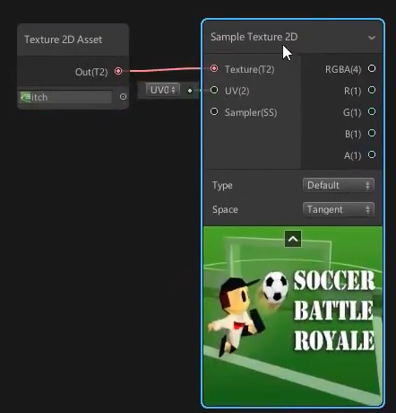
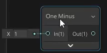

# Artistic美术
## Channel Mixer颜色通道混合
颜色通道混合

## Contrast对比度

## Hue色调

## Invert colors反转颜色

## Replacce Color替换颜色
用一个颜色替换另一个颜色，可以调整过渡

## Saturation饱和度

## White balance白平衡
如果想要暖色调

## Blend混合
可以混合两张textrue

## Dither抖动

## Channel Mask

## Color mask
如果想要屏蔽图像中所有的绿色像素

## Normal blend法线混合
两张法线贴图的混合

## Normal From Height
从高度图生成法线贴图

## Normal From Texture
从texture生成法线贴图

## Normal strength法线强度
改变法线强度

## Colorspace Conversion
颜色空间转换，如果想要把颜色分开，这是非常有用的

# Channel通道
## split

## Combine
将不同通道组合在一起

## Flip翻转
可以翻转一些颜色

## Swizzle
可以改变向量的各个分量的顺序。
如果使用这个节点，将纹理连进来，保存asset，关闭再打开，才能正常工作。

# Input

## boolean
可以用一个branch节点来区分两个不同的输入，true就输出x， false就输出y。

## color

## constant数学常数

## integer

## slider

## time
记录了从开始到现在的时间

## 几何

### Bitangent vector双切线

### Normalvector顶点法线

### position顶点位置
### Screen position屏幕空间的顶点位置
### tangent vector 切线向量
### UV
### vector color顶点的默认颜色
### view direction相机方向

## Gradient渐变

## 光照

### ambient环境光

### baked烘培
烘焙进全局光照

### reflection probe反射探针

## 矩阵

### transformation Matrix（MVP矩阵）

## PBR

### Dielectric Specular电介质镜面

### metal reflectance金属反射率

## 场景

### camera

### fog

### object对象本身

### scene color场景颜色

### Scene depth

### screen屏幕

## Textrue
textrue节点总是以一对出现

### Cubemap Asset 和 Sample Cubemap

### Texture 2D asset 和 Sample texture 2D

### Texture 2D Array Asset
纹理数组，通过索引访问其中一个

### Texture 3D Asset

### Sampler State采样状态
可以帮助导入纹理

### Texel size像素大小
可以改变分辨率

# Master
master节点可以访问PBR和unlit

# Math
## absolute绝对值

## Exponential指数
## length向量的模
## log
## Modulo取余
## Negate取反
## Normalize
## posterize色调分离
将连续的颜色拆成阶梯状

## Reciprocal取倒数
## Reciprocal Square Root倒数平方根

## add加
## subtract减
## divide除
## Multiple乘
## Power幂指数
## Square root平方根

## DDX 对x求导
## DDY
## DDXY

## 插值
### lerp线性插值
### inverse Lerp
逆转插值结果，得到T的值

### smoothstep
## 矩阵
### Matrix Construction构造矩阵

### Matrix Determinant行列式
### Matrix Split分离矩阵的行或列

### Matrix Transpose转置矩阵
## 范围Range
### clamp
将输入值限定在最小值和最大值之间
### Fraction小数部分
### Maximum
### Minimum
### One minus

### Random Range随机数
基于种子生成一个最小值和最大值之间的浮点数

### Remap映射
将一个范围的数映射到另一个范围

### Saturate
将输入值限定在0到1。

## Round近似

### ceiling向上取整
### florr向下取整
### Round四舍五入
### sign输出正负号
### step
输入一个阈值edge，小于edge的输出0，大于edge的输出1

## 三角函数

### Degrees To Radians
角度转为弧度
### Radians To Degrees
## 向量
### distance
### Dot Product
### Cross Product

### 菲涅尔项

### Sphere Mask
### Ratote About Axis按轴旋转
### Reflection反射方向
### Projection投影
### transform切换坐标空间
求模型空间中的原点，在世界空间下的坐标

## Wave波
### Noise Sine Wave正弦波
### Sawtooth Wave锯齿波

### Square Wave方形波

### Triangle Wave三角形波

# Procedual程序化纹理
## Checkrboard棋盘

## Noise

## Shape几何图形
可以用它们来做遮罩
### ellipse椭圆
### polygon多边形
### Rectangle矩形
### Rounded Rectangle圆角矩形

# Util
## preview预览
可以输入任何东西，并且只显示颜色

## logic逻辑运算符

### Is infinite是否无穷
### Is Front Face是否是正面
如果想要使用这个节点，必须回到PBR Master中设置双向渲染

### Comparison比较两个数

### branch分支
打勾就输出True的内容，否则相反。

# UV
## flipbook序列帧动画

## Polar Coordinates极坐标

## radial Shear径向剪切
就像在材质上有一个无形的球，

## Rotate旋转

## Spherize

## tilling and offset平铺和偏移

## Twirl旋涡

## Triplanar

